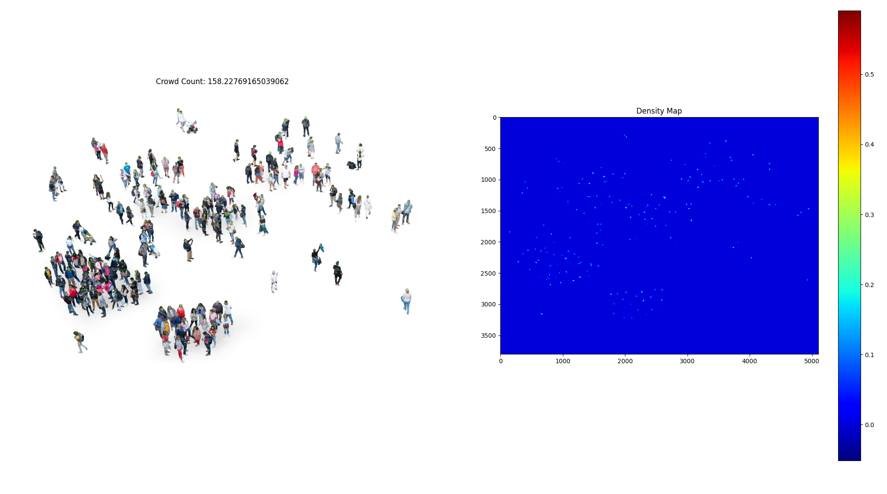

# Crowd Counting with Simplified CSRNet Implementation

## Overview

This repository presents a concise and efficient PyTorch implementation of the CSRNet architecture for crowd counting, optimized for compatibility with Mac M1/M2/M3 GPUs and Nvidia GPUs. It includes comprehensive code for dataset preparation, model training, and visualization, suitable for both research and practical applications.

## Results

**Key Features:**

CSRNet Architecture: Leverages dilated convolutions for precise density estimation.

GPU Acceleration: Employs PyTorch with MPS for efficient training on Mac M1/M2/M3 GPUs, and cuda for Nvidia GPUs.

Streamlined Implementation: Focused on core model and training pipeline for clarity.

Dataset Handling: Prepares the ShanghaiTech dataset, including density map generation.

Memory Optimization: Addresses GPU memory limitations during density map creation.

## Prerequisites:

- Python 3.6 or later
- PyTorch 1.4 or later
- torchvision
- h5py
- scipy
- matplotlib
- Pillow (PIL Fork)
- Pytorch should be downloaded with cuda to work properly if on windows

## Usage Guide

1. **Acquire Dataset:**

   Download the ShanghaiTech dataset from [here](https://paperswithcode.com/dataset/shanghaitech) and extract it into `ShanghaiTech` within this repository.

2. **Generate Density Maps:**

   Execute `makedataset.py` to efficiently create density maps, optimizing memory usage.

3. **Explore Data Visually:**

   Run `densityChecker.py` to visualize an image-density map pair for understanding.

4. **Train the CSRNet Model:**

   Initiate model training with `train.py`, maximizing performance on Mac M1/M2/M3 GPUs.

## Model Architecture

- Employs initial 23 layers of pre-trained VGG16 for feature extraction.
- Backend: Incorporates 6 convolutional layers with ReLU activations for density map generation.

## Showcase Results

Below are the visualizations of the results based on jpg images in the repository:

*Insert showcase images here*

## Additional Information

- `dataset.py` defines a custom dataset class for seamless data loading and preprocessing.
- `model.py` encapsulates the SimplifiedCSRNet model architecture.

## References

- Original CSRNet Paper: [CSRNet: Dilated Convolutional Neural Networks for Understanding the Highly Congested Scenes](https://arxiv.org/abs/1802.10062)
- Reference PyTorch Implementation: [CSRNet-pytorch](https://github.com/leeyeehoo/CSRNet-pytorch)